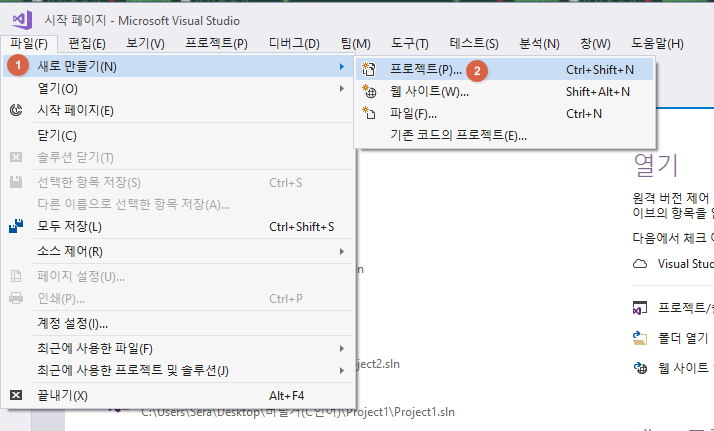
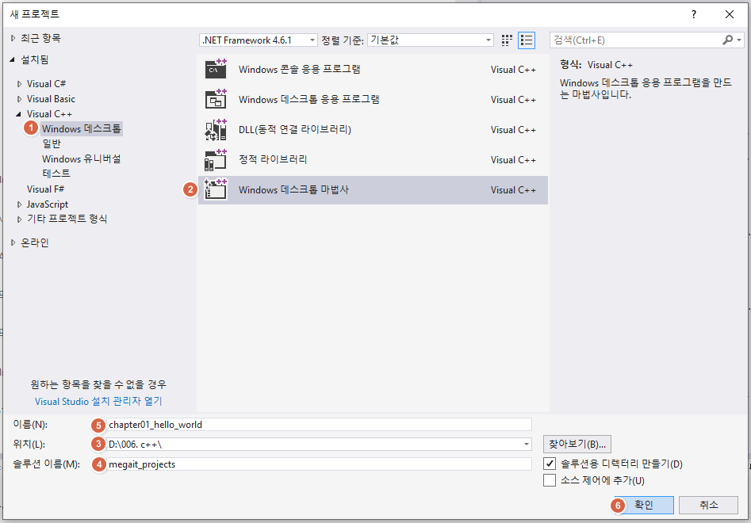
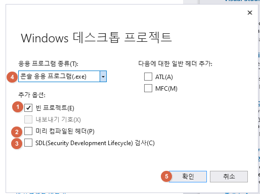
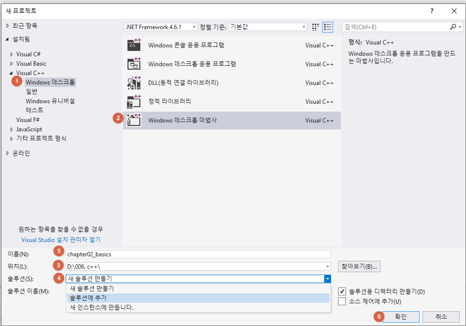

# 1. 솔루션 및 프로젝스 생성

## 1-1. 신규 솔루션 및 프로젝트 생성

| 1           |
| --------------------------------- |
| **2** |
| **3** |
| **4** |


## 1-2. 기존 솔루션에 프로젝트 추가


## 1-3. 특정 프로젝트를 시작프로젝트로 활성화


# 2. 소스파일

## 2-1. 소스파일 추가

```c++
#include <iostream>

int main() 

	std::cout << "Hello, World!" << std::endl;
	return 0;
}
```


## 2-2. 소스파일을 빌드에서 제외
